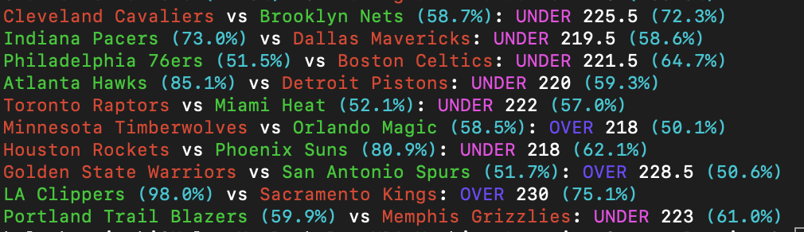
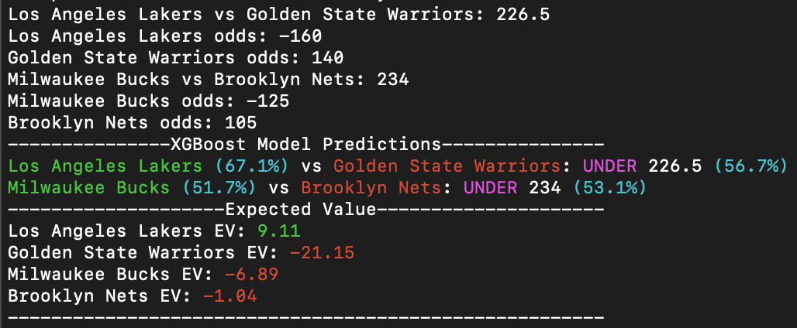
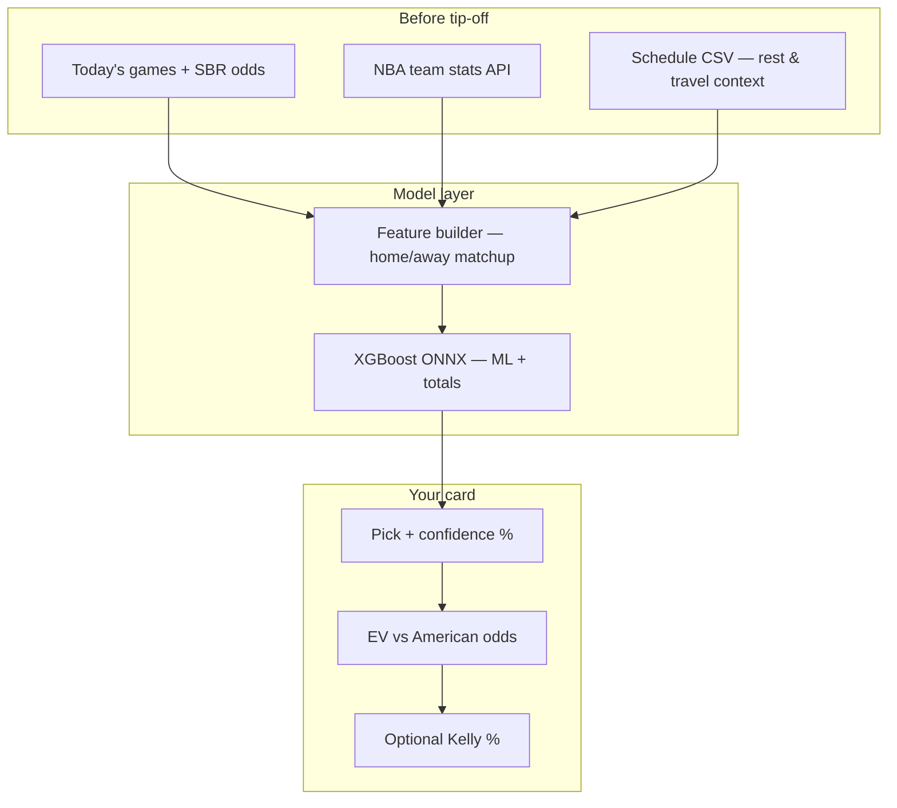

# 🏀 NBA Machine Learning Sports Betting

**Find edges before tip-off.** This tool pulls tonight's NBA slate, layers in team form and rest, runs proven XGBoost models, and compares your model's win probability to **live sportsbook lines** — so you can spot **+EV moneyline and total** plays fast.

<p align="center">
  
</p>

<p align="center">
  <strong>Moneyline model · ~69% validation accuracy</strong> &nbsp;|&nbsp;
  <strong>Totals model · OVER/UNDER signals</strong> &nbsp;|&nbsp;
  <strong>EV + optional Kelly sizing</strong>
</p>

---

## Why NBA bettors use this

| You get | What it means at the window |
|--------|-----------------------------|
| **Side + confidence %** | Model favorite on the moneyline with a calibrated probability |
| **OVER / UNDER + line** | Totals pick against the book's posted number |
| **Live odds pull** | FanDuel, DraftKings, BetMGM, and more via one flag |
| **Expected Value (EV)** | Green = model thinks the price is better than fair; red = pass |
| **Kelly (`-kc`)** | Suggested % of bankroll when you want sizing math (use responsibly) |

> **Not a picks service.** This is a research CLI. Lines move, injuries happen, and models miss — always verify before you bet.

---

## See it in action

**Tonight's board** — color-coded sides, confidence, and totals:

<p align="center">
  
</p>

**Expected value vs the book** — where the model disagrees with the price:

<p align="center">
  
</p>

---

## Quick start (3 commands)

**Requirements:** Node.js 20+

```bash
npm install
npm run typecheck   # optional sanity check
npm run predict -- -odds=fanduel
```

Add **`-kc`** when you want Kelly fraction of bankroll alongside EV:

```bash
npm run predict -- -odds=draftkings -kc
```

Run tests anytime:

```bash
npm test
```

---

## How tonight's slate becomes a bet



1. **Odds** — Scrapes your sportsbook's lines for tonight (`-odds=<book>`).
2. **Stats** — Pulls current team efficiency, pace, and form from the NBA stats API.
3. **Context** — Uses the season schedule to factor **days rest** into each matchup.
4. **Predict** — Two ONNX models: **moneyline winner** and **over/under** vs the book total.
5. **Edge check** — EV compares model win probability to the posted American price; Kelly optional.

---

## Supported sportsbooks

Pass any of these to `-odds=`:

| Sportsbook | Flag |
|------------|------|
| FanDuel | `-odds=fanduel` |
| DraftKings | `-odds=draftkings` |
| BetMGM | `-odds=betmgm` |
| PointsBet | `-odds=pointsbet` |
| Caesars | `-odds=caesars` |
| Wynn | `-odds=wynn` |
| BetRivers NY | `-odds=bet_rivers_ny` |

---

## Reading the output like a bettor

**Moneyline row**

```
Celtics (62.3%) vs Lakers: OVER 224.5 (58.1%)
```

- **Celtics (62.3%)** — Model's preferred side and win probability.
- **OVER 224.5 (58.1%)** — Totals lean and confidence on that side of the line.

**Expected value**

```
Celtics EV: 4.12        ← positive EV on Celtics ML at current price
Lakers EV: -6.88        ← model says Lakers price is too steep
```

With **`-kc`** you also see `Fraction of Bankroll: X%` — a Kelly-style stake suggestion. Most bettors use **fractional Kelly** (e.g. half-Kelly) in practice.

---

## Project layout

| Path | Purpose |
|------|---------|
| `src/cli/main.ts` | CLI entry — odds, predictions, EV/Kelly |
| `src/nba/` | Stats, schedule, feature engineering |
| `src/odds/` | Sportsbook odds (SBR) |
| `src/predict/` | XGBoost ONNX inference |
| `src/utils/` | Expected value & Kelly criterion |
| `Models/onnx/` | `xgb_ML.onnx`, `xgb_UO.onnx` (runtime models) |
| `Data/nba-2025-UTC.csv` | Season schedule for rest calculations |
| `tests/ts/` | Vitest specs for betting math |

---

## Regenerating ONNX models

If you have XGBoost JSON exports under `Models/XGBoost_Models/`:

```bash
python3 tools/export-onnx.py
```

Requires Python with `xgboost` and `onnxmltools`.

---

## Responsible betting

- Models are trained on **historical** regular-season data — playoffs, back-to-backs, and late scratches behave differently.
- **Positive EV ≠ guaranteed profit.** Variance is real; use proper bankroll management.
- Compare lines across books; this tool checks **one book at a time**.
- Never bet money you cannot afford to lose.

---

## Contributing

PRs welcome. If you change features, model inputs, or EV math, update `tests/ts/` and this README.

---

<p align="center">
  <sub>Built for hoop heads who want data on their side — not hype.</sub>
</p>
